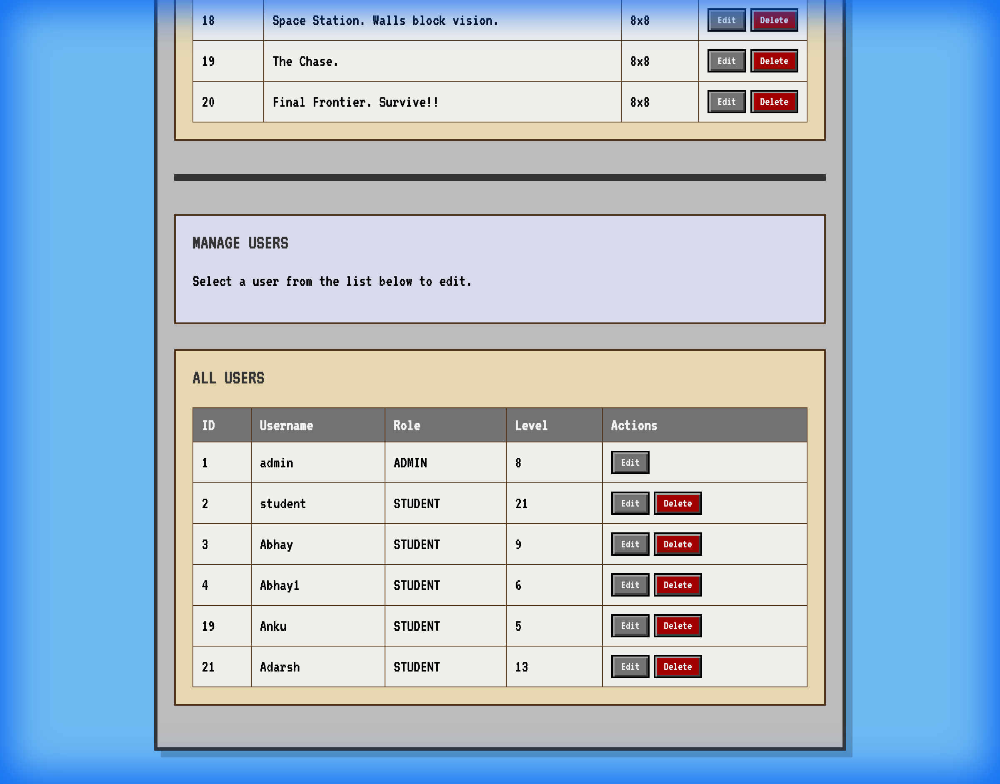
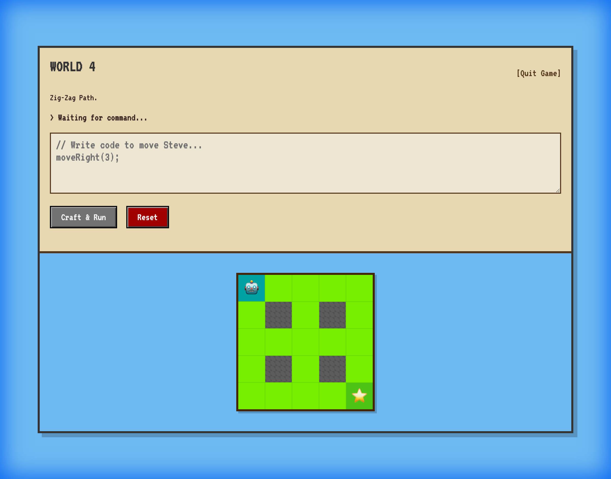
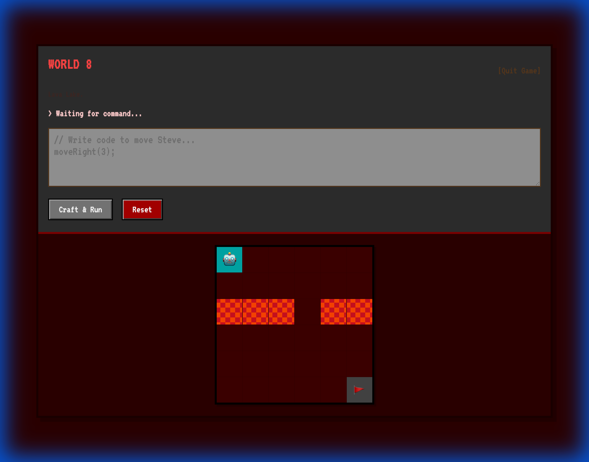
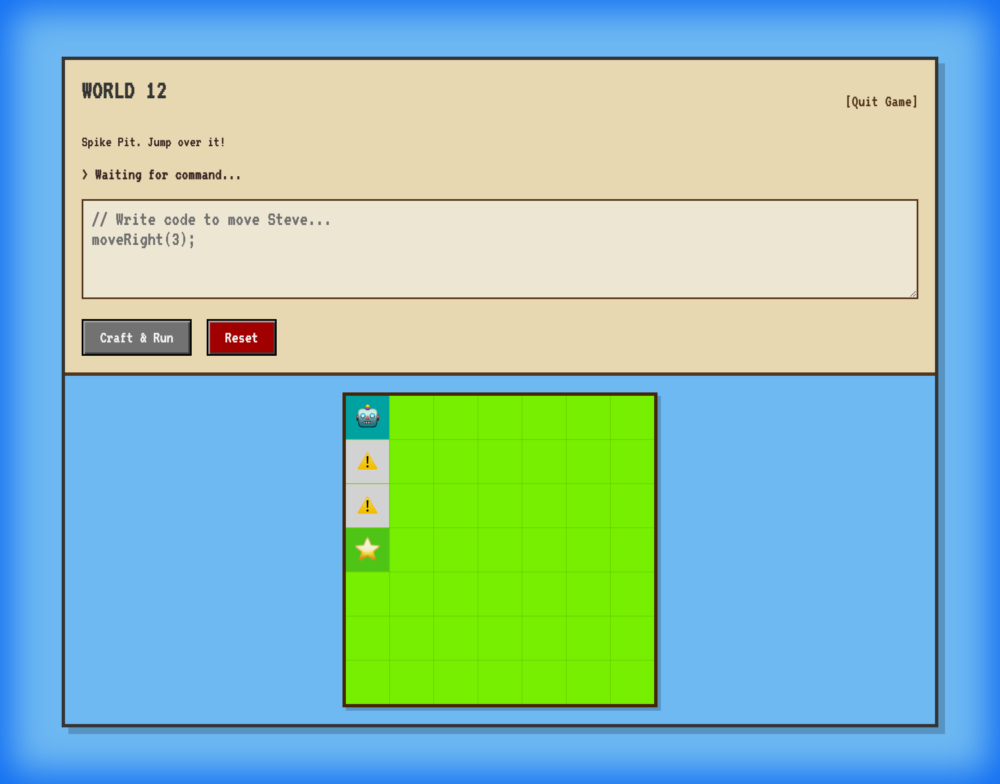
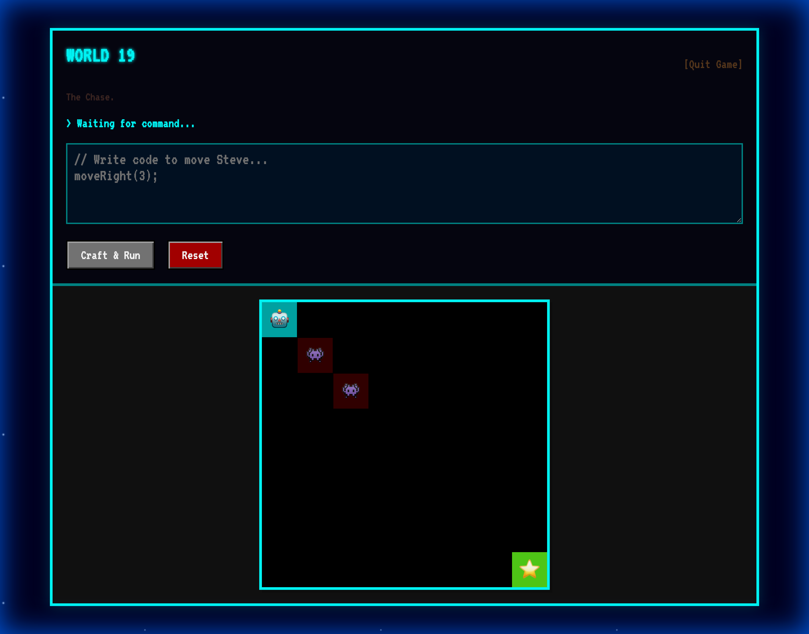

# LogicLab

LogicLab is an interactive, web-based educational puzzle game designed to teach basic coding concepts and logic. Players guide a character through various levels using code-like commands, unlocking new challenges as they progress.

## 🖼️ Screenshots

### Admin Dashboard


### Gameplay Levels
| Level 4 | Level 8 |
|:---:|:---:|
|  |  |

| Level 12 | Level 19 |
|:---:|:---:|
|  |  |

### Victory Page


---

## 🚀 Features

*   **Interactive Gameplay**: Solve puzzles using commands like `moveRight()`, `jumpDown()`, etc.
*   **Level Progression**: 20 increasingly difficult levels to master.
*   **User Accounts**: Secure login system with role-based access (Student/Admin).
*   **Admin Dashboard**: Manage users and create/edit levels dynamically.
*   **Victory Statistics**: Global leaderboard and victory screen upon completion.

---

## 🛠️ Tech Stack

*   **Frontend**: JSP, HTML5, CSS3, JavaScript
*   **Backend**: Java (Servlets, Core Logic)
*   **Database**: MySQL 8.0+
*   **Server**: Apache Tomcat 10/11
*   **Development**: Standard Java Project Structure (No Maven/Gradle required, raw classpath compilation)

---

## 📋 Prerequisites

Before you begin, ensure you have the following installed:

*   **Java Development Kit (JDK)**: Version 17 or higher.
*   **Apache Tomcat**: Version 10.x or 11.x.
*   **MySQL Server**: Version 8.0 or higher.

---

## 📥 Installation & Setup

### 1. Clone the Repository
```bash
git clone https://github.com/AbhoyShah1810/JavaMiniProject.git
cd JavaMiniProject
```

### 2. Database Setup
You need to create a dedicated user and initialize the database schema.

**Automated Setup (Mac/Linux):**
```bash
./database/create_user_and_setup.sh
```
*Enter your MySQL root password when prompted.*

**Manual Verification:**
You can verify the setup by logging in as the new user:
```bash
mysql -u logiclab -plogiclab123 -e "SHOW TABLES IN logiclab;"
```

### 3. Configure Connection
Ensure the database credentials in `src/main/java/com/logiclab/db/DBConnection.java` match your setup (default is correct if you used the script):
```java
private static final String DB_USERNAME = "logiclab";
private static final String DB_PASSWORD = "logiclab123";
```

---

## 🏗️ Build & Run

This project uses a manual compilation process to keep things simple and educational.

### 1. Compile and Deploy
**macOS / Linux:**
*Modify the destination path (`/path/to/tomcat/webapps`) to match your local Tomcat installation.*

```zsh
javac -d src/main/webapp/WEB-INF/classes \
      -cp "src/main/webapp/WEB-INF/lib/*" \
      src/main/java/com/logiclab/db/*.java \
      src/main/java/com/logiclab/game/*.java && \
cp -R src/main/webapp/* /path/to/tomcat/webapps/LogicLab/
```

**Windows (PowerShell):**
```powershell
javac -d src/main/webapp/WEB-INF/classes -cp "src/main/webapp/WEB-INF/lib/*" src/main/java/com/logiclab/db/*.java src/main/java/com/logiclab/game/*.java; Copy-Item -Recurse -Force src/main/webapp/* "C:\Program Files\Apache Software Foundation\Tomcat 10.1\webapps\LogicLab\"
```

### 2. Start Server
Start your Tomcat server:
```bash
catalina run
```

---

## 🎮 Usage

Open your browser and navigate to:
**[http://localhost:8080/LogicLab/](http://localhost:8080/LogicLab/)**

### Default Accounts
| Role | Username | Password |
|---|---|---|
| **Student** | `student` | `student123` |
| **Admin** | `admin` | `admin123` |

### Admin Panel
Access the admin panel at `/admin.jsp` to:
*   Manage Users (Reset passwords, promote students).
*   Level Editor (Create and modify game levels).

---

## 📂 Project Structure
```
JavaMiniProject/
├── database/            # SQL setup scripts
├── Levels/             # Level data definitions
├── src/main/java/      # Backend Java code
├── src/main/webapp/    # Frontend (JSP, CSS, Assets)
├── COMMANDS.md         # Helpful dev commands
└── SETUP.md            # Detailed setup guide
```
