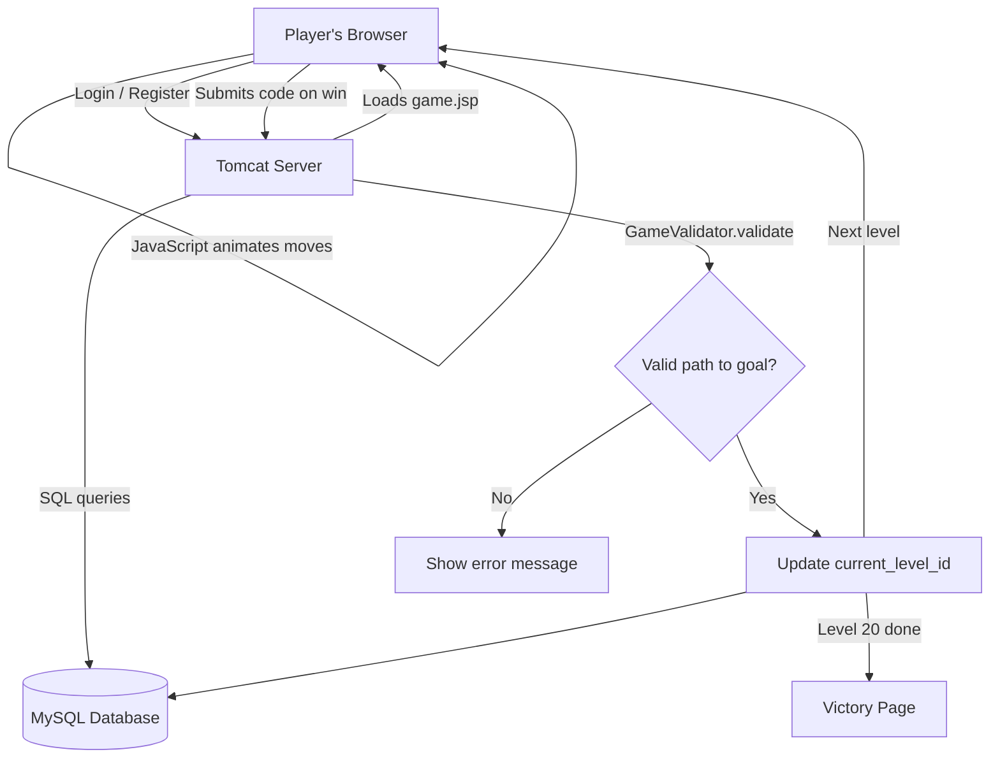

# LogicLab — How It Works (Explained Simply)

This guide explains how LogicLab works so you can teach it to someone around 15 years old. Think of it like explaining a video game that secretly teaches coding.

---

## The Big Idea (30-Second Version)

LogicLab is a **puzzle game where you control a character by writing tiny bits of code**.

Instead of pressing arrow keys, you type commands like:

```java
moveRight(2);
moveDown(3);
```

Your job: get the character from the **start** tile to the **goal** tile without crashing into walls, lava, mines, or other dangers.

There are **20 levels**. Beat them all and you win.

---

## Real-World Analogy

Imagine three people working together:

| Piece | What it is | Real-life analogy |
|-------|------------|-------------------|
| **Your browser** | The screen you see and click on | The TV screen + controller |
| **Tomcat (the server)** | Runs the Java code behind the scenes | The game console |
| **MySQL (the database)** | Stores users, passwords, and level data | A filing cabinet with save files |

You type code in the browser → the server checks if it's correct → the database remembers your progress.

---

## What Happens When You Play (Step by Step)

### 1. You open the website

You go to `http://localhost:8080/LogicLab/`.

The **home page** (`index.jsp`) is just a welcome screen with Login and Register buttons.

### 2. You log in

On the **login page** (`login.jsp`):

1. You type your username and password.
2. The server asks the database: *"Does this user exist with this password?"*
3. If yes → you're in. The server creates a **session** (like a temporary wristband that says "this person is logged in").
4. Students go to the game. Admins go to the admin panel.

**Session** = the server remembers who you are while you browse, so you don't have to log in on every single page.

### 3. The game loads your current level

On the **game page** (`game.jsp`):

1. The server checks: *"Is this person logged in?"* If not → back to login.
2. It looks up your username in the database and finds your `current_level_id` (e.g. Level 5).
3. It loads that level's data from the `levels` table:
   - **description** — what the level is about
   - **grid_layout** — where walls, lava, start, goal, etc. are placed
   - **grid_size** — how big the map is (5×5, 6×6, etc.)

### 4. You write code and click "Craft & Run"

This is where the fun logic happens. There are actually **two brains** working:

#### Brain #1: JavaScript (in your browser) — the animator

File: `assets/js/game.js`

- Reads your code line by line
- Moves the character on screen, step by step (with animations)
- Shows instant errors like "Crashed into a wall!" or "Melted in lava!"
- On harder levels, enemies can move and spot you
- If you reach the goal → it automatically sends your code to the server

**Why?** So the game feels fast and visual, like a real video game.

#### Brain #2: Java (on the server) — the referee

File: `GameValidator.java`

- Receives your code after the browser says you won
- **Re-simulates** every move from scratch (without fancy graphics)
- Checks the same rules: walls, lava, mines, spikes, bushes, grid edges
- Returns `true` only if you end up exactly on the goal tile

**Why?** Because you can't trust the browser alone. A clever user could cheat with browser tools. The server is the **final judge**.

```
You type code
     ↓
JavaScript animates it (fun + fast feedback)
     ↓
Reached goal? → Send code to server
     ↓
GameValidator simulates it again (honest check)
     ↓
Correct? → Level up!   Wrong? → "Try again"
```

### 5. You beat a level

If the server says your code is valid:

1. Your `current_level_id` in the database goes up by 1 (e.g. 5 → 6).
2. The page reloads with the next level.
3. After Level 20 → you go to the **victory page** with a leaderboard.

---

## How the Map Works

Each level is a **grid** — like a chess board or Minecraft floor made of squares.

The map is stored as a text string in the database, for example:

```
0,0,START; 1,1,WALL; 2,2,GOAL
```

Each piece means: `row, column, TYPE`

| Type | What it does |
|------|--------------|
| `START` | Where your character begins |
| `GOAL` or `FLAG` | Where you need to end up |
| `WALL` | Solid block — you can't walk or jump through it |
| `LAVA` | Instant death if you step or land on it |
| `MINE` | Instant death if you step or land on it |
| `SPIKE` | Instant death if you step or land on it |
| `BUSH` | Blocks walking, but you **can jump over** it |
| `ENEMY` | A robot that moves toward you (browser-only challenge) |

Rows and columns start at **0** (programmer counting, not human counting).

Example on a 5×5 grid:

```
(0,0) (0,1) (0,2) ...
(1,0) (1,1) (1,2) ...
...
```

---

## The Commands (Your "Code")

### Walking commands — one tile at a time

| Command | Meaning |
|---------|---------|
| `moveRight(n)` | Walk right n steps |
| `moveLeft(n)` | Walk left n steps |
| `moveUp(n)` | Walk up n steps |
| `moveDown(n)` | Walk down n steps |

**Walking rules:**
- You check **every single tile** you step on.
- You cannot walk through walls or bushes.
- You cannot walk onto lava, mines, or spikes.
- You cannot walk off the edge of the map.

### Jumping commands — leap over gaps

| Command | Meaning |
|---------|---------|
| `jumpRight(n)` | Jump right n tiles in one go |
| `jumpLeft(n)` | Jump left n tiles |
| `jumpUp(n)` | Jump up n tiles |
| `jumpDown(n)` | Jump down n tiles |

**Jumping rules:**
- You fly over everything **in between** (including bushes and hazards).
- You still **cannot jump through walls**.
- You still **cannot jump off the map**.
- You **must land on a safe tile** — landing on lava/mines/spikes = fail.
- Landing on a bush is OK.

**Analogy:** Walking is like carefully stepping on every floor tile. Jumping is like hopping over a puddle — you skip the middle, but you still can't phase through a brick wall, and you need a safe place to land.

### Comments

Lines starting with `//` are ignored. They're for notes to yourself:

```java
// Go around the wall first
moveDown(2);
moveRight(3);
```

---

## How `GameValidator` Thinks (The Server Logic)

This is the core algorithm. In plain English:

```
1. READ THE MAP
   - Go through every item in grid_layout
   - Build lists of: walls, hazards, bushes
   - Remember start position and goal position

2. READ THE PLAYER'S CODE
   - Split into lines (by ; or new line)
   - Skip empty lines and comments

3. FOR EACH COMMAND
   - Figure out: move or jump? which direction? how many steps?
   - Simulate the movement on the grid
   - If anything illegal happens → return FALSE (you lose)
   - If OK → update your position and continue

4. AFTER ALL COMMANDS
   - Are you standing on the goal tile?
   - YES → return TRUE (you win)
   - NO  → return FALSE (not there yet, or wrong path)
```

The validator doesn't care about fancy graphics. It only tracks two numbers: **your row** and **your column**.

---

## Level Difficulty Progression

The 20 levels are grouped by what they teach:

| Levels | Theme | What you learn |
|--------|-------|----------------|
| 1–5 | Stone | Basic movement, avoiding walls |
| 6–10 | Lava | Hazards — plan your path carefully |
| 11–15 | Nature | Jumping over bushes and spike pits |
| 16–20 | Space | Enemies that chase you and have line-of-sight |

Grid size also grows: 5×5 → 6×6 → 7×7 → 8×8.

---

## The Database (What Gets Saved)

Two main tables:

### `users` table
| Column | Purpose |
|--------|---------|
| `username` | Your login name |
| `password` | Your password |
| `current_level_id` | Which level you're on (your save progress) |
| `role` | `STUDENT` or `ADMIN` |

### `levels` table
| Column | Purpose |
|--------|---------|
| `level_id` | Level number (1 to 20) |
| `description` | Hint text shown to the player |
| `grid_layout` | The map (walls, start, goal, etc.) |
| `solution_key` | One correct answer (used as reference; the validator accepts any valid path) |
| `grid_size` | Board dimensions |

**Important:** The game doesn't just check if your code matches `solution_key` exactly. It runs your code through the simulator. If your solution is different but still reaches the goal legally, it still counts!

---

## Admin Panel (Bonus)

Admins (`admin` / `admin123`) get a special dashboard (`admin.jsp`):

- **Create / edit / delete levels** — change the maps and puzzles
- **Manage users** — reset passwords, change someone's level, promote to admin

Same idea: browser form → server talks to database → changes saved.

---

## How the Code Gets to Your Computer (Build & Deploy)

When a developer updates the project:

1. **Compile** Java files → turns `.java` into `.class` files the server can run
2. **Copy** the whole `webapp` folder into Tomcat's `webapps/LogicLab/` folder
3. **Start Tomcat** → it serves the website on port 8080

Tomcat is basically a program that says: *"Someone wants `game.jsp`? Let me run the Java inside it and send back HTML."*

---

## Architecture Diagram



---

## Key Files Cheat Sheet

| File | Role |
|------|------|
| `index.jsp` | Home page |
| `login.jsp` / `register.jsp` | Account system |
| `game.jsp` | Main game — loads level, handles submissions |
| `victory.jsp` | Win screen + leaderboard |
| `admin.jsp` | Admin tools |
| `assets/js/game.js` | Browser animation + instant feedback |
| `GameValidator.java` | Server-side move simulator (the referee) |
| `DBConnection.java` | Connects Java code to MySQL |
| `database/init.sql` | Creates tables and sample data |
| `Levels/populate_levels.sql` | All 20 level definitions |

---

## Fun Facts / Things Worth Mentioning

1. **It's like learning to code without scary syntax** — no classes, no `public static void main`, just simple commands.
2. **The server always double-checks** — this is how real web apps work (never trust the client).
3. **Levels are just data** — an admin can add new levels without rewriting the whole game, because the map is stored as text in the database.
4. **Sessions keep you logged in** — that's why closing the tab might log you out eventually, but clicking around doesn't ask for your password every time.
5. **Multiple solutions can work** — as long as your path is legal and ends on the goal, you pass.

---

## Default Login Accounts

| Role | Username | Password |
|------|----------|----------|
| Student | `student` | `student123` |
| Admin | `admin` | `admin123` |
